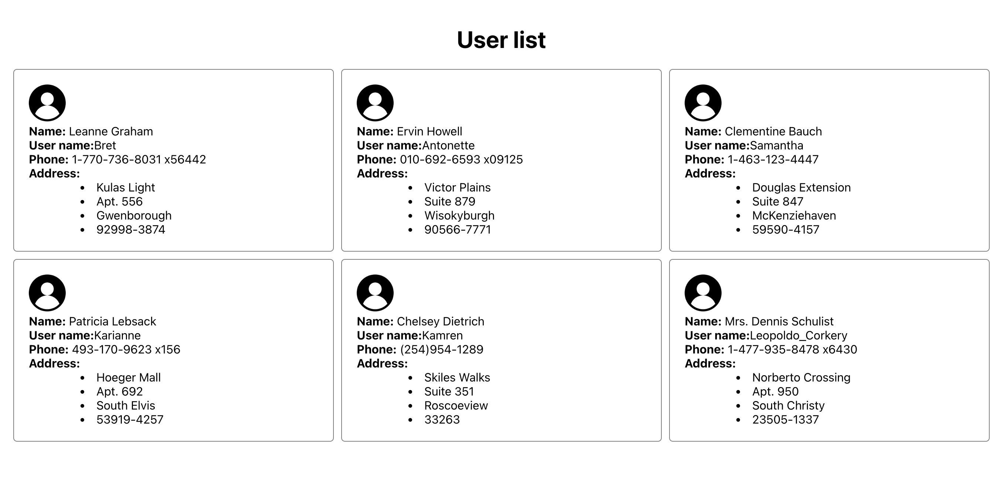
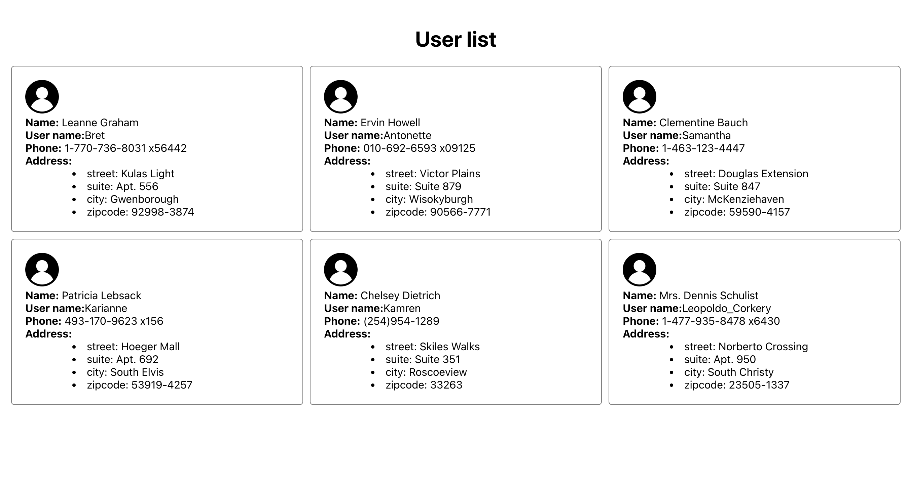

# TypeScript in React

## How to run project

1. Step 1: yarn
2. Step 2: yarn start

## Requirements

1. Pass the `userList` array from `App` component to `UserList` component
2. Display the user information in `UserItem` component
3. Extra task: display the user address as the second screenshot

## Example

The final result should look like the screenshot below

1. The user list
   
2. The user list with address detail
   
